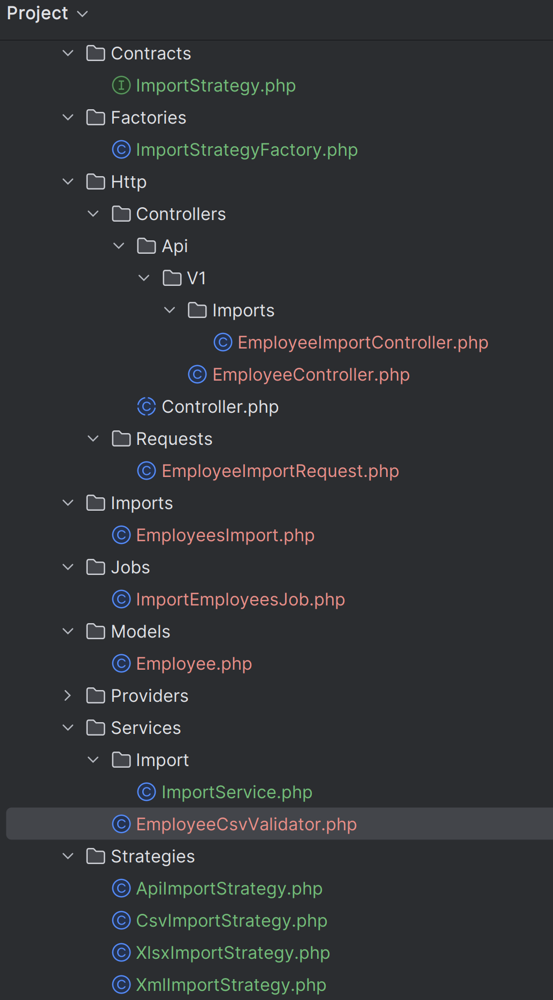

# Technical Test

## Requirements

- PHP 8.0+
- MySQL/MariaDB
- Composer
- Laravel 11.x
- Queue worker (Redis or Database)
- Laragon to launch the project with .test domain

## Installation

1. Clone the repository:
```bash
git clone https://github.com/akhelij/brand-x-challenge.git
cd brand-x-challenge
composer install
```
 2. here the .env file used in the project 
```bash
APP_NAME=Laravel
APP_ENV=local
APP_KEY=base64:5tZPecbIBBMIDjyov+8jdSDPsF3/gvyvAoFTcx0Y+yg=
APP_DEBUG=true
APP_TIMEZONE=UTC
APP_URL=http://brand-x-challenge.test/

APP_LOCALE=en
APP_FALLBACK_LOCALE=en
APP_FAKER_LOCALE=en_US

APP_MAINTENANCE_DRIVER=file

BCRYPT_ROUNDS=12

LOG_CHANNEL=stack
LOG_STACK=single
LOG_DEPRECATIONS_CHANNEL=null
LOG_LEVEL=debug

DB_CONNECTION=mysql
DB_HOST=127.0.0.1
DB_PORT=3306
DB_DATABASE=coding_challenge_db
DB_USERNAME=your_username
DB_PASSWORD=your_password

SESSION_DRIVER=database
SESSION_LIFETIME=120
SESSION_ENCRYPT=false
SESSION_PATH=/
SESSION_DOMAIN=null

BROADCAST_CONNECTION=log
FILESYSTEM_DISK=local
QUEUE_CONNECTION=database

CACHE_STORE=database
CACHE_PREFIX=

MEMCACHED_HOST=127.0.0.1

REDIS_CLIENT=phpredis
REDIS_HOST=127.0.0.1
REDIS_PASSWORD=null
REDIS_PORT=6379
```
3. run migration
```bash
php artisan migrate
```

4. Start queue:
```bash
php artisan queue:work --tries=3 --max-jobs=1000 --sleep=3 --timeout=300
```

5. Batch import employees:
```bash
curl -X POST -F "type=csv" -F "file=@import.csv" http://brand-x-challenge.test/api/v1/employee
```

Cross fingers and enjoy!

### Thoughts

- I want to demonstrate that I am familiar with this type of challenge, so I decided a cherry on the cake by implementing strategy design pattern for multiple source import process.
- I focused on the quality of the code and the architecture of the project.
- You will find empty xmlImportStrategy class, just to simulate the idea of the strategy pattern.
- Also, I added small things like api versioning.
- I added the package `maatwebsite/excel` to handle the csv file import. It's a very good package that return the failure as jobs, so we can handle the failure in a better way.
- The package also allow us to handle the import in chunks, so we can import a big file without any problem, without the headache of implementing the chunking logic ourselves.
- The only issues that might face us with this package is the amazon sqs queue, because the package doesn't support it, so we have to implement the logic ourselves.


Data Flow:
- Request → Controller → Factory → Strategy → Queue → Database

### Improvements
- First of all in the front end I will provide to the user a form to allow him map the csv file columns with the database columns.

- Also, in real life we might need to add tests to make sure the import is working as expected.
- Listing the rows that failed for later review by the user.
- An Api documentation using swagger or postman. I prefer Postman.

- There is a lot of things that can be done to improve the project, but I think this is a good start.
#
